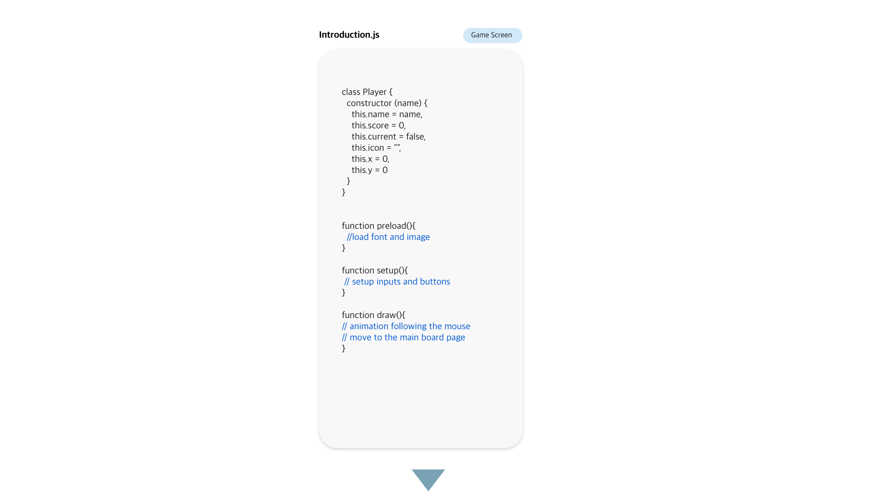
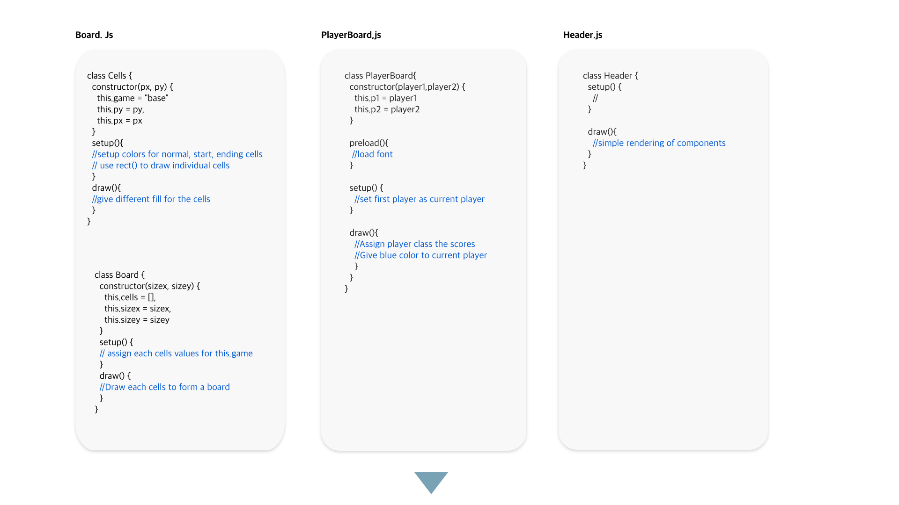
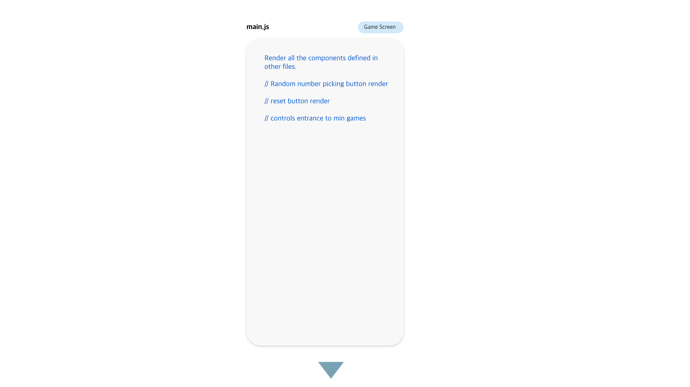
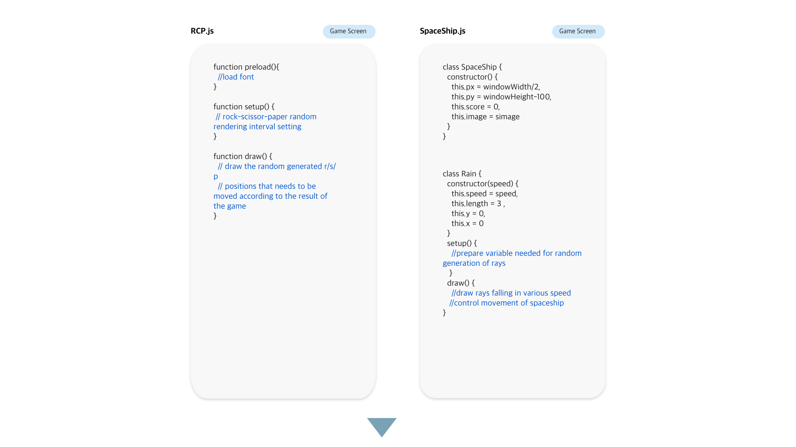
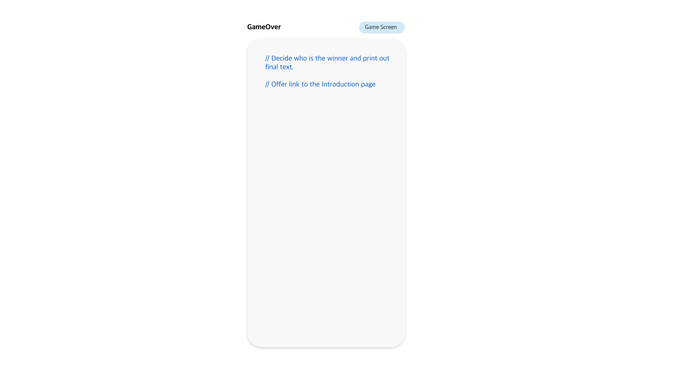
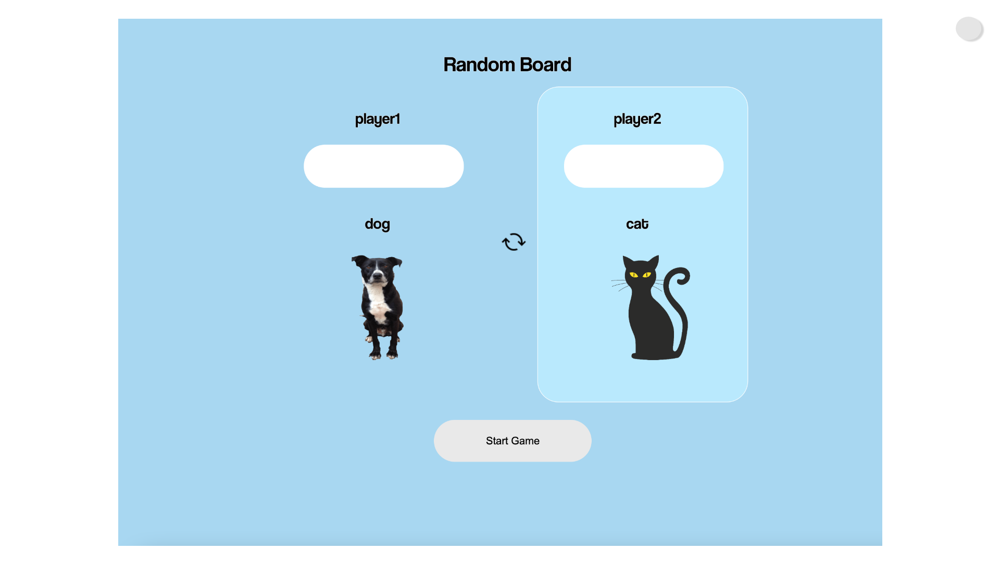
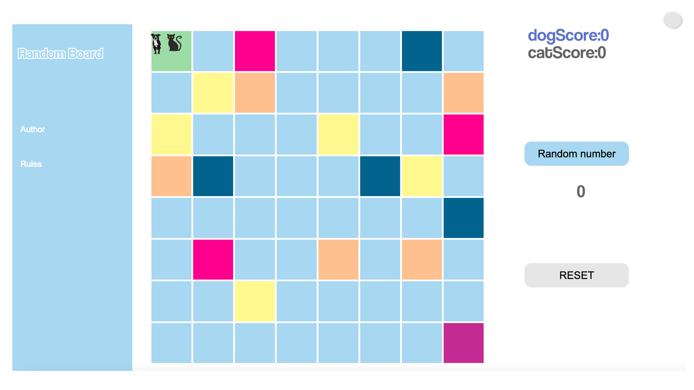
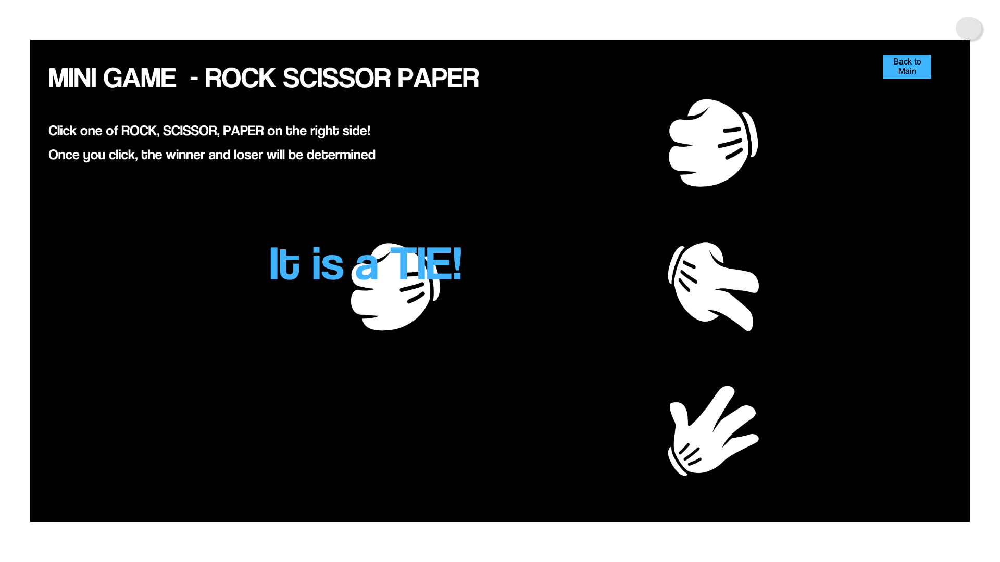
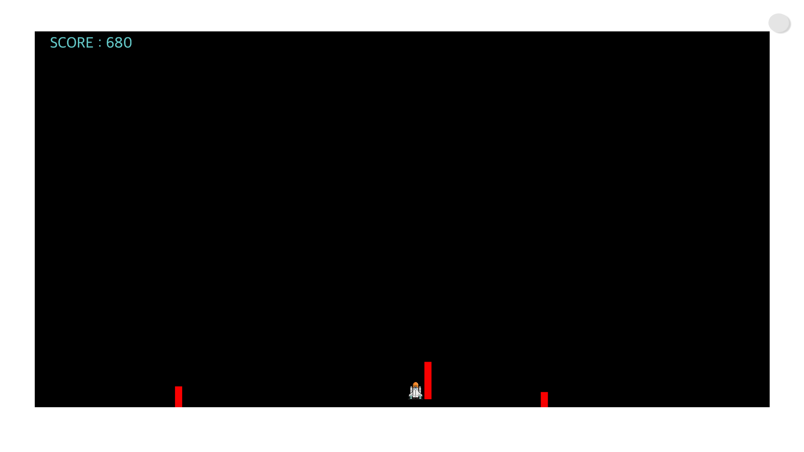
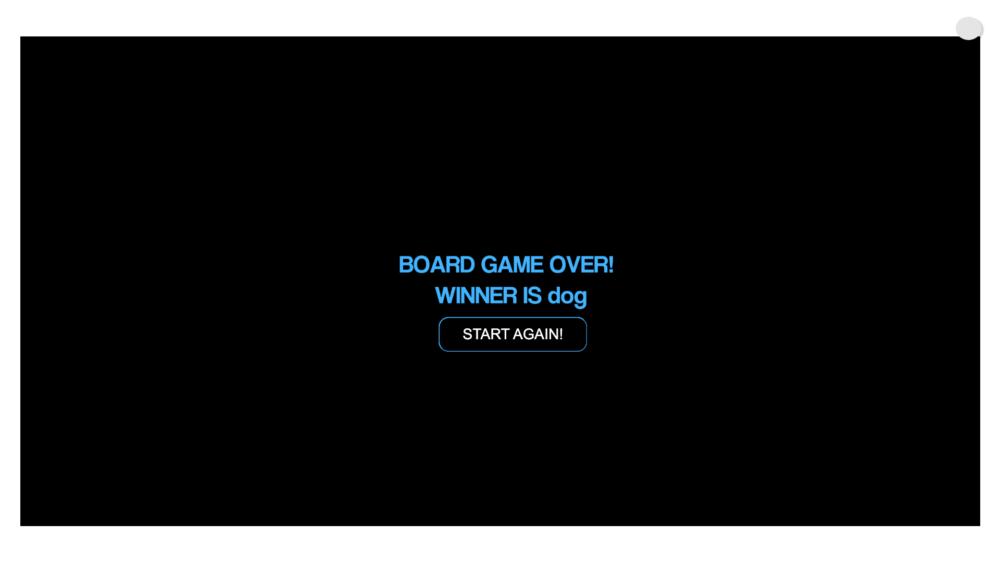

Name: 20180517

Email : michellekjs@kaist.ac.kr

GIT repository : http://git.prototyping.id/20180517/mid_project.git


# Random Board Game
## Summary
This game is a board game that was inspired by the snake ladder game. The first person to reach the end of the board wins the game. The board game's each plates have hidden mini-games or advantage/disadvantages.\


## Structure
### Image Explanation






In the following order, the codes were built. There are explanations about what is written in each of the files in the "//" of each functions


### Starting page


The starting page is written in the code _Introduction.js_ and _index.html_ .
The function of the starting page is to get the player's name as inputs and use them to use in the main game. Along with the name input, the players are displayed on the board game with the characters they chose in the introduction page. If the player presses the 'switch' icon in the center of the screen, each of the players will have switched characters from the default characters. 


### Board page


The board page is written in _Board.js_ , _main.js_, _PlayerBoard.js_, _Header.js_ . 
The board page is the main screen of the game. The characters that match each of the player's choice at the introduction site moves along the board. Clicking the "Random number" button, a random number in range 0 to 4 is created and the character moves that amount. There are cells where there are minigames or jumps to other cells. When one person finishes their turn, switching to the second player is done by pressing the **"c"** on the keyboard. The game continues and when one of the player reaches the end of the boardgame, the game is over. 


### Games
Games are written in _Games_ folder. There are 3 games which are each written in folders _RCPGame, SpaceshipGame_. 

#### RCP Game


RCP game is rock-scissors-papers. The rock, scissor, paper are randomly chosen at the same time the player chooses rock/scissor/paper. According to the randomly picked npc's rock/scissor/paper, and the player's choice, the winner is determined. Like the spaceship game, the player gets advantage/disadvantage by the result.

#### Spaceship Game


Spaceship game is where the player controls the position of the spaceship using the arrow keys of the keyboard. The player has to avoid the incoming red rays and last long. The longer they last, they will earn additional jumps to another board cell. When the player is hit by the ray or if certain amount of time passes, the game will end with the "Game Over" sign and the player can return to the boardgame main page. If the player does not last until their score becomes 1000, he will be moved to the previous cell. If the player does last, he will be moved to the next cell.

### Game Over 


Game over page is written in _GameOver.js_ and _gameover.html_ files. It gets information about who is the winner of the game and provides a button to restart the game

# Organization of the code & code explanation
## Introduction page
The most important thing is that the player class is defined in _Introduction.js_

```js
class Player {
  constructor (name) {
    this.name = name,
    this.score = 0,
    this.current = false,
    this.icon = "",
    this.x = 0,
    this.y = 0
  }
  ///
}
```

The player has name, which is recieved by the input component of p5.js. 'score' is where the score of the player is defined. 'current' is to determine whose turn it is to play. 'icon' is used to determine if the player's character is cat or a dog. Finally, and most importantly, 'x' and 'y' determines the position of the players on the board game. 


## Board Game
### components/Board.js
Class Cell's constructor is like the following. 
```js
class Cell{
  constructor(px, py) {
    this.game = "base"
    this.py = py,
    this.px = px
  }
  ///
}
```
The **"game"** determines which game the cell has. It has options  "base", "jump", "reverse", "spaceship", "rcp" . If the player is on the cell with one of these options, the game will do appropriate actions(Start a mini game or move the player front/ back). The color of the cells are different according to the this.game. **px** and **py**  contains information of the position of the cell. 


class Board's constructor is like the following. 
```js
class Board {
  constructor(sizex, sizey) {
    this.cells = [],
    this.sizex = sizex,
    this.sizey = sizey
  }
  ///
}
```
Along the x-axis and the y-axis , the cells are rendered to form a board(inside the setup() function). Then I set the cells' game to "jump", "reverse", "spaceship", "rcp". 

### components/PlayerBoard.js
In this file, the score of the players are displayed. The player's score is the total amount of forward movement that the player made. Getting the player information from the localStorage, we use the stored player's name and score. The current player's text will be displayed in blue color, and this is determined using the player's class current constructor. 

The playerboard class is defined like the following. player1, player2 parameters are each player objects.

```js
class PlayerBoard{
  constructor(player1,player2) {
    this.p1 = player1
    this.p2 = player2
  }
```


I exported the defined PlayerBoard class to use it in the _main.js_ file. In the draw() function, according to whose this.current is value "true", that player's score text is blue. Throughout the entire code,I used this if-else statement to decide which player's change was occured.
```js
 if (this.p1.current == true) {
    //code of text rendering 
  }
  else {
   //...
  }
```

### components/Header.js
Header is for the UI of the game. It contains the title of the game,and the author. There is no interaction in this part, only simple rendering of the scene. Each of the letters in the Header are buttons created by createButton function. 

```js
 let button = createButton('Author');
```

### components/Games/RCP.js
I downloaded images from the Internet with illustration of rock scissor paper hands. 

### components/Games/SpaceShip.js
There are two classes defined in this file. 
_class Spaceship_ is the class to contain information and render the spaceship. 
```js
class SpaceShip {
  constructor() {
    this.px = windowWidth/2,
    this.py = windowHeight-100,
    this.score = 0,
    this.image = simage
  }
}
```
The spaceship's position is stored in teh constructor variables  **px** and **py**. 

```js
class Rain {
  constructor(speed) {
    this.speed = speed,
    this.length = 3 ,
    this.y = 0,
    this.x = 0
  }
```
 _class Rain_ is where the red rays coming toward teh spaceship is defined. We can set the speed of the rays using the constructor **speed**. The form of the ray is a thin rectangle. If the spaceship lies within the range of the ray , you will lose the game and the mini-game will be over. 

```js
  rain.draw();
  rain2.draw();
  rain3.draw();
```

The rays in my code are written like the above code. It seems like there are only 3 rays, but it would be continuously rendered when it reaches the ground(the position where the spaceship is)

### ./Main.js
_Main.js_ is where the *random number picking* and *character moving* operation is done. The other pages were setting for this main.js page. First, by importing the header and the board, I setup the page. Then, I put the buttons to randomly pick integers for character movement, and reset button just in case the player wants to start the game from the start. 

```js
function keyPressed(){
  if (key == 'c') {
    scoreboard.p1.current = !scoreboard.p1.current
    scoreboard.p2.current = !scoreboard.p2.current
  }
}
``` 
This function enables the players to switch turns pressing random number button and play. 
Then, we check the cells list which we defined in the _Board.js_ to see if the cell the character is on is whether "base", "jump", "reverse", "spaceship", "rcp". For each of the cases, certain actions are made. "jump" and "reverse" moves the position of the character immediately. The "spaceship" and "rcp"moves to the game page by using 

```js
  window.location.href = "../mini.html"
  window.location.href = "../rcp.html"
```
respectively.

## How are the codes connected?

I stored the information about the cells and the players on the localStorage. These are the codes that often appear on my code.

```js
  localStorage.setItem("player1", JSON.stringify(p1));
  localStorage.setItem("player2", JSON.stringify(p2));

  let p1 = JSON.parse(localStorage.getItem("player1"))
  let p2 = JSON.parse(localStorage.getItem("player2"))
```

I retrieved the information about the current position of the player, and whose turn it is to play. 


# References
1. P5.js libarary
All the implementations are just a pure development from what I learned from this class. There are no external sites that I looked at for code. 
2. Image sources
- rock, scissor, paper : pngset.com
- dog, cat: pngitem.com